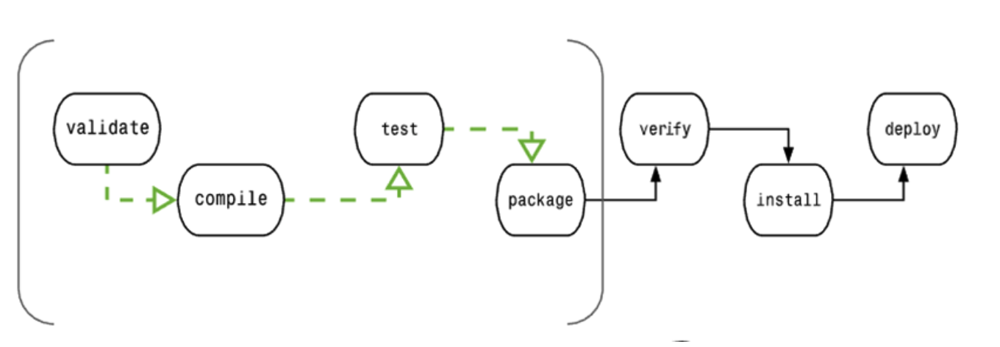
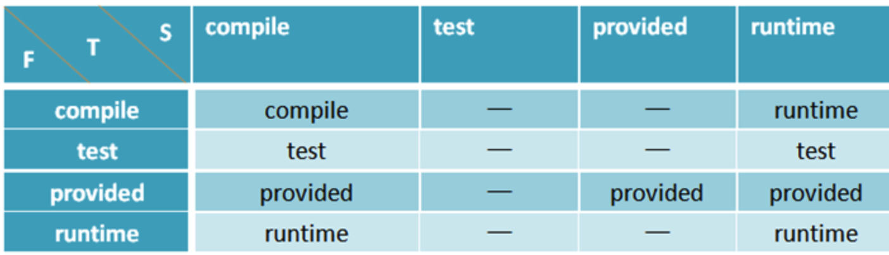
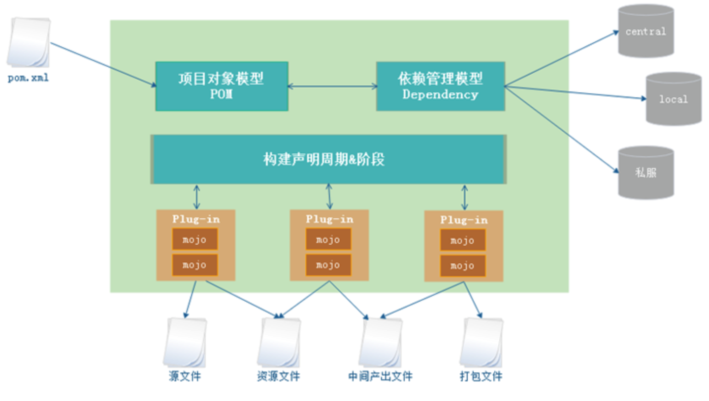
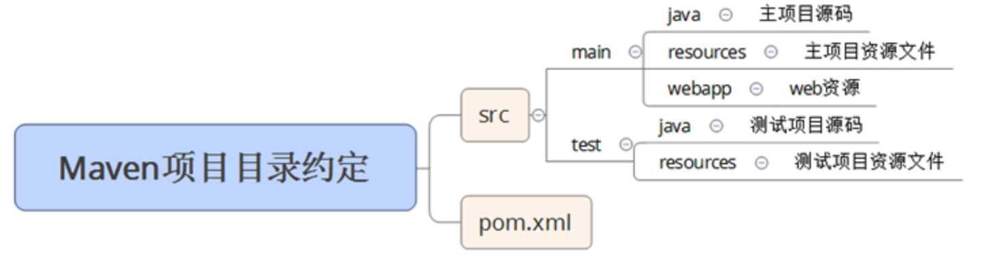
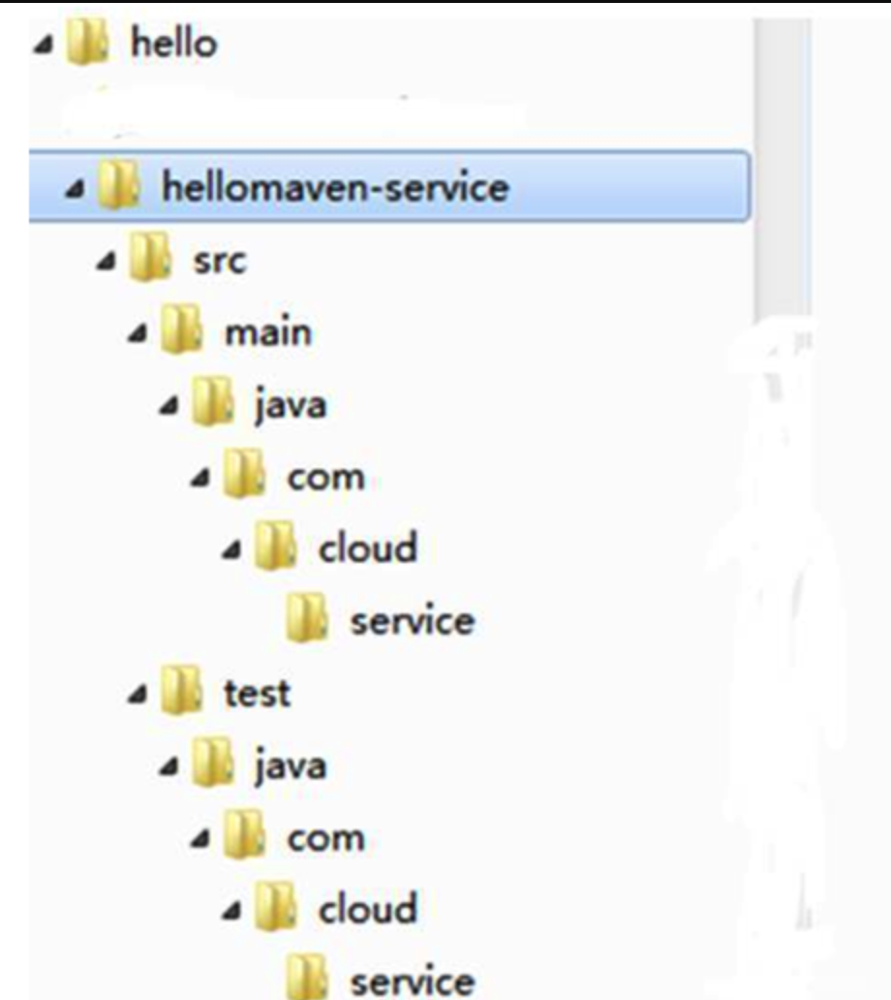
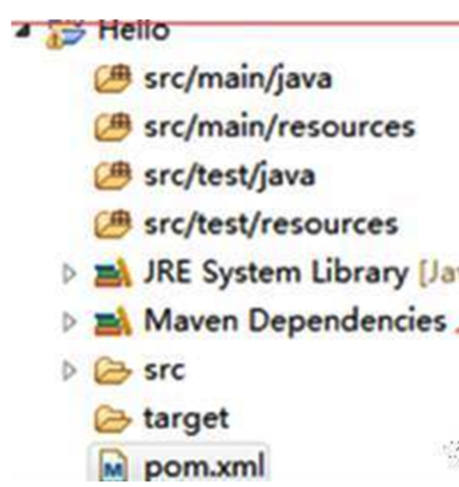
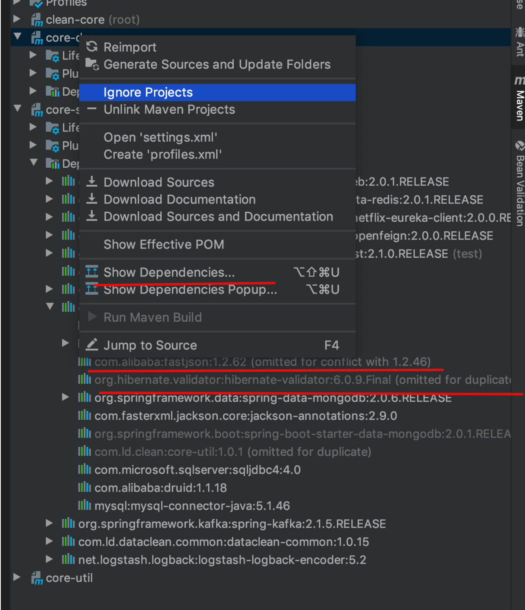
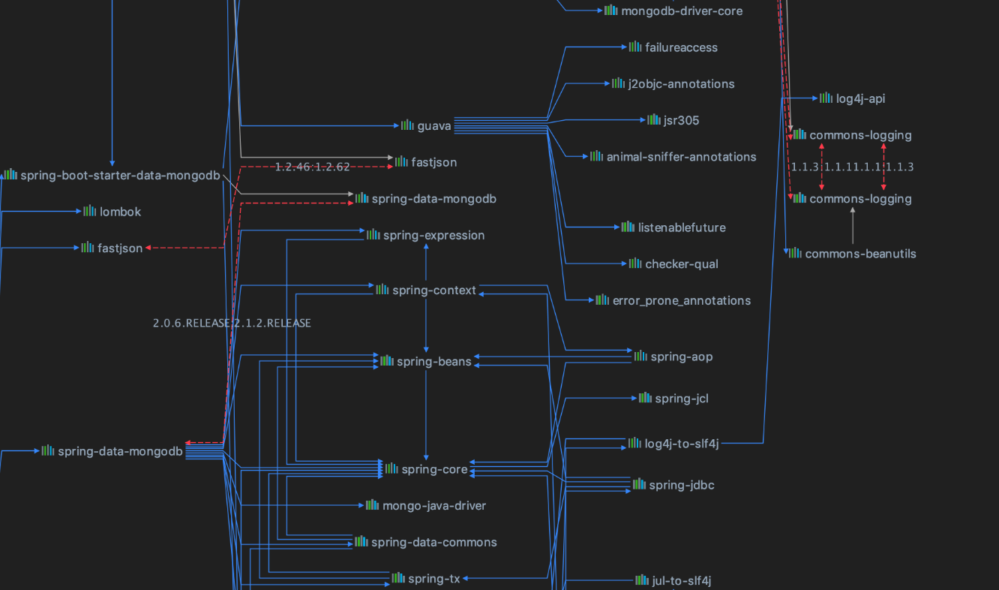
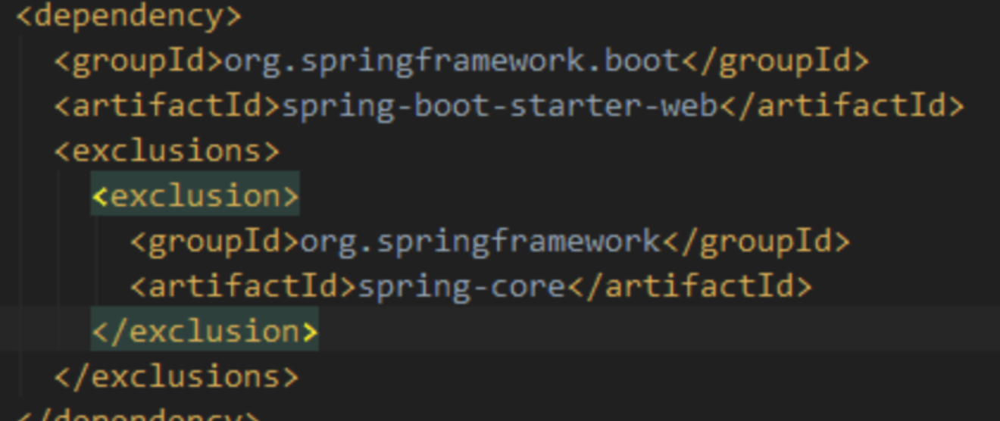

# Maven笔记

## Maven简介

Maven翻译成中文是“专家、内行”。

Maven是Apache组织中一个颇为成功的开源项目，Maven主要服务于基于Java平台的项目构建、依赖管理和项目信息管理的优秀工具。

Maven 也可以构建其他项目，例如 C#、Ruby、Scala 和其他语言的项目。


Maven是优秀的构建工具：自动化构建过程、跨平台、标准化构建过程。

Maven为Java开发者提供了一个免费的中央仓库，其中几乎可以找到任何流行的开源类库，通过Maven的衍生工具Nexus，可以进行快速的搜索。


Maven项目目录结构有约定的规则，约定优于配置（Convention Over Configuration）。


> Maven is - at its heart - a plugin execution framework; all work is done by plugins.

Maven 本身可以理解为一个插件框架，它本身有一些自带的插件，例如 clean、package，同时，也可以允许用户自定义开发插件。我们可以根据自己的需求，开发各色各样的插件，集中到 Maven 这个框架当中。

Maven是声明式的，项目构建过程和过程各阶段所需工作都要插件实现，大部分插件都是现成的，开发者只需要声明项目的基本元素，Maven就可以执行内置的，完整的构建过程。


### Maven的功能

- 构建
- 文档生成
- 报告
- 依赖
- SCMs
- 发布
- 分发
- 邮件列表


### Maven的特点

- 项目设置统一
- 任意工程中共享
- 依赖管理自动
- 一个庞大且不断增加的库
- 可扩展
- 只需要很少的配置
- 基于模型构建
- 项目信息一致性
- 发布管理和发布单独输出
- 向后兼容性
- 并行构建
- 子项目，可以使用父项目
- 并行构建
- 更好的错误报告


## 插件开发

通过插件开发流程了解maven插件的原理 

https://gitbook.cn/books/606bfe0ba5abbc0521b53e7d/index.html


## 概念

### lifecycle（生命周期）

当我们对一个项目进行打包，Maven 会执行项目验证（validate）--> 源码编译（compile）--> 打包（package），这样一个过程就是一个生命周期。

#### 常见的生命周期

Maven项目构建过程中，主要构建命令有几种：

- mvn validate 验证，验证项目是正确的并且所有的信息是可用的；
- mvn clean 清理，清理项目缓存输出，一般是target文件夹被删除；
- mvn compile 编译，将java源文件编译成.class文件；
- mvn test 测试，生成测试报告，运行test目录下的所有单元测试；
- mvn package 打包，将项目打成jar、war或者pom；
- mvn install 安装，将当前项目安装到本地maven库，供其他项目依赖；
- mvn deploy部署，在构建环境中完成，复制最终的包到远程库，其他人可以从远程仓库依赖这个项目，进行协同开发。

执行后面的命令会自动执行前面的命令，比如执行mvn package时会执行validate、clean、compile、test、package五个阶段。




### phase（阶段）

其中的每一个过程就叫做阶段（phase)，验证、编译、打包都是一个独立的阶段。


### goal（目标）

阶段由插件来执行完成，一个插件里面包含多个执行单元，这个就是 goal。一个插件就是有多个小目标组成。


示例：clean 和 pakage 是构建阶段，`dependency:copy-dependencies` 是目标

```
mvn clean dependency:copy-dependencies package
```


### 构件

在Maven的世界，任何一个依赖、插件或者项目构建的输出，即xxx.jar

任何一个构件都有一组坐标唯一标识。


### Maven坐标

唯一标识Maven构件，坐标元素分为groupId、artifactId、version、packaging、classifier.

**groupId:**必选，定义当前Maven项目隶属的实际项目，不一定是一对一的关系，通常一个实际项目会被划分成很多模块。groupId一般不应该只定义到公司级别，一个公司可能会有很多实际项目，如果groupId只定义到组织级别，那么artifactId只能定义Maven项目。命名方式和Java包名类似，域名反向一一对应。例如：org.springframework.

**artifactId:**必选，定义实际项目中的一个Maven模块，推荐使用实际项目名称-模块名称，这样便于找到某个项目的一组构件。例如：spring-core,spring-beans,spring-web等。

**version:**必选，定义Maven项目当前所处的版本。例如：4.3.9.RELEASE、1.0-SNAPSHOT、RELEASE、LATEST、2.1等。

**packaging:**可选默认是jar，定义Maven项目的打包方式。打包方式有jar、war、pom等。

**classifier:**不能直接定义，帮助定义构建输出的一些附属构件。附属构件与主构件对应，例如*-javadoc.jar、*-sources.jar附属构件包含了java文档和源代码。

### 仓库

得益于坐标机制，任何Maven项目使用任何一个构件的方式都是完全相同的，在此基础上，Maven可以在某个位置统一存储所有Maven项目共享的构件，这个统一的位置就是仓库。


**中央仓库：** Maven默认的远程仓库，安装文件中自带了中央仓库的配置，在`${M2_HOME}/lib/maven-model-builder-3.2.5.jar`中，解压缩找到`org\apache\maven\model\pom-4.0.0.xml`,可以看到如下默认远程仓库配置：

```
<repositories>
  <repository>
   <id>central</id>
   <name>Central Repository</name>
   <url>https://repo.maven.apache.org/maven2</url>
   <layout>default</layout>
   <snapshots>
    <enabled>false</enabled>
   </snapshots>
  </repository>
</repositories>
```

这个配置文件是所有Maven项目都会继承的超级POM.


### 依赖管理

依赖管理分为传递性依赖、依赖调解、可选依赖、排除依赖、归类依赖等。


**传递性依赖**

A **->** B **->** C，即A对B是第一直接依赖，B对C是第二直接依赖，A对C是传递性依赖，第一直接依赖（简称F）和第二直接依赖（简称S）的范围决定了传递性依赖（简称T）的范围。如图所示：



结论：

当S=compile时，T与F的范围一致；

当S=test时，依赖不会传递；

当S=provided时，只有当F=provided时，T=provided；

当S=runtime时，T=F，但F=compile例外，此时T=runtime.

**依赖调解**

依赖调解第一原则：路径最近者优先。

例如：A **->** B **->** C **->** X1 长度为3 A **->** D **->** X2 长度为2，因此X2会被解析使用


依赖调解第二原则：第一原则优先，依赖路径相等时，POM中依赖声明顺序靠前的优先。

例如：A **->** B **->** X1 长度为2 A **->** C **->** X2 长度为2，但是POM文件中B的依赖声明靠前，因此X1会被解析使用。


**可选依赖**

A依赖于B，B依赖于X和Y，B对于X和Y的依赖都是可选依赖，即optional=true

可选依赖不会传递，即X、Y对A没有影响。


**排除依赖**

使用exclusions元素声明排除依赖，exclusions包含一个或者多个exclusion子元素，因此可以排除一个或者多个传递性依赖。

注意声明exclusion时只需要groupId和artifactId，而不需要version元素，因为只需要groupId和artifactId就可以唯一定位依赖图中的某个依赖。

**归类依赖**

spring的依赖包版本都是相同的，可以使用properties元素定义Maven属性spring.version=5.x

在定义依赖时可以使用${}方式来引用Maven属性，例如${spring.version}。


## 常用配置说明

### settings.xml文件说明

#### 配置全局或当前用户的settings.xml

**全局范围：** `${maven.conf}/settings.xml`

**用户范围：** `${user.home}/.m2/settings.xml`，只有当前用户才会受到该配置影响，还便于Maven的升级，Maven升级新版本时不需要触动该文件，推荐配置用户范围。


#### 关键属性

##### **设置HTTP代理**

公司网络需要通过安全认证的代理访问因特网，这种情况下需要为Maven配置HTTP代理，才能正常访问外部仓库下载所需要的资源。

在settings.xml文件中添加代理配置。

proxies下可以添加多个proxy节点，默认第一个active为true的会生效。

nonProxyHost表示不需要代理访问的地址。中间的竖线分隔多个地址，此处可以使用星号作为通配符号。


##### **远程仓库的认证**

一些远程仓库出于安全考虑需要提供用户名、密码进行认证才能访问，这时需要配置认证信息，认证信息必须配置到setting.xml文件中.

setting.xml文件中server元素的id必须与pom.xml文件中需要认证的repository元素的id完全一致。


##### **镜像**

如果仓库X可以提供仓库Y存储的所有内容，则X可以被称为Y的一个镜像。镜像往往能够提供比中央仓库更快的服务，配置Maven使用镜像来代替中央仓库，编辑setting.xml文件。


### pom.xml文件配置说明 「未完成TODO」

#### **parent父项目配置**

project根节点下配置parent节点指定继承的父项目坐标，groupId、artifactId、version必选，唯一标识父项目，relativePath：可选，父项目的pom.xml文件的相对路径，默认值是../pom.xml.

Maven首先在当前构建项目的地方寻找父项目的pom，其次在本地文件系统的relativePath位置，然后在本地仓库，最后在远程仓库寻找父项目的pom.


**Dependencies 和 DependencyManagement**

- <dependencies> 使项目中具体使用的 jar，它是用来管理依赖关系的（子模块只能被动继承父模块的版本号），<dependencyManagement> 主要的功能是版本管理，集中管理依赖版本不添加依赖关系，子模块虽然是自动继承父模块的版本，但如果子模块也自己声明了版本，以自己的生命的版本为准。
- 如果<dependencyManagement> 没有某个 jar 的引入，子模块自己引入到 pom 也是可以的。


**Plugins 和 PluginManagement 的区别**

````
<pluginManagement>
    <plugins>
        <plugin>
            <groupId>org.apache.maven.plugins</groupId>
            <artifactId>maven-source-plugin</artifactId>
            <version>2.1</version>
            <configuration>
                <attach>true</attach>
            </configuration>
            <executions>
                <execution>
                    <phase>compile</phase>
                    <goals>
                        <goal>jar</goal>
                    </goals>
                </execution>
            </executions>
        </plugin>
    </plugins>
</pluginManagement>
````

另外一个子模块也需要 plugin 的配置：

````
<plugins>
    <plugin>
        <groupId>org.apache.maven.plugins</groupId>
        <artifactId>maven-source-plugin</artifactId>
    </plugin>
</plugins>
````

省去了版本号以及其他一些配置，还使整个项目保持了统一的配置，如果需要调整版本或者配置项，只需要改 pluginManagement 中的即可。


# 原理

## 概念模型

Maven根据项目的pom.xml文件，把它转化成项目对象模型(POM)，这时要解析依赖关系，然后去相对应的maven库中查找所依赖的jar包。

在clean，compile，test，package等生命周期阶段都有相应的Plug-in来做这些事情，而这些Plug-in会产生一些中间产物。



## 依赖解析机制

当本地仓库没有依赖构件的时候，Maven会自动从远程仓库下载；当依赖版本为快照版本时，Maven会自动找到最新的快照。

当依赖的版本不明晰的时候，如RELEASE、LASTEST、SNAPSHOT，Maven就需要基于更新远程仓库的更新策略来检查更新。


# 应用

## 四种Maven创建方式

### 手动方式构建

Maven项目由一个自己默认的配置，使用者不需要修改那些约定的内容，这就是“约定优于配置”，按照Maven项目目录约定，手动创建各个文件夹即可，一般不会使用这种方式。

动态web的Maven项目的目录约定如下图所示：



### 命令行

本地磁盘建立一个空目录/hello；

进入到空目录，执行下面的命令 

> mvn archetype:generate -DgroupId=com.cloud.hellomaven -DartifactId=hellomaven-service -Dversion=1.0.0-SNAPSHOT -Dpackage=com.cloud.service

说明：

archetype:generate：生成maven项目骨架

- DgroupId指定maven坐标的groupId
- DartifactId指定maven坐标的artifactId
- Dversion指定maven坐标的version
- Dpackage指定maven项目的src下的包名

自动创建的maven项目结构如下：



### Eclipse IDE

Eclipse提供了一个很好的插件m2eclipse无缝将Maven和Eclipse集成在一起，配置插件选择本地maven目录和配置文件setting.xml即可。

点击Eclipse菜单栏File->New->Ohter->Maven，选择Maven Project，一路默认Next，有一步需要填写Group Id、Artifact Id、Version、选择打包方式Package（jar、war、pom），选择编译环境即可。

完成后目录结构如下：



### Idea IDE

创建一个maven web项目的过程如下：

选择File-New-Project，选择Maven，勾选Create from archetype，选择maven-archetype-webapp,

点击Next，填写Group Id、Artifact Id、Version三项，

点击Next，选择Maven home，选择setting file,

点击Next，填写Project name，选择项目路径即可，

Finish完成maven web项目创建。


## Maven 依赖冲突的解决方案

### **依赖冲突发生原因**

假如项目中两个模块都需要以来同一个 a.jar，而项目中的引入的两个 a.jar 的版本不一致可能就会形成依赖冲突。

一个引入的是 a.v1.0.0.jar，另一个引入的是 a.v1.0.1.jar，maven 会根据相同路径谁先声明选择谁，如果不同路径按照最短路径选择。

假如 a.v1.0.1.jar 升级后删除了 a.v1.0.0 中的类。在编译阶段可能不会报错，因为编译时只是把代码编译成 class 文件。

在运行的时候，可能就会报 NoClassDefFoundError 的错误。


### **查找依赖冲突**

1. 我们使用 idea 自带的 maven 查看到有冲突的 jar，通过 Show Dependencies…查看具体的依赖关系如下图：




2. 通过命令`mvn dependency:tree`查看依赖树，把有红线依赖关系进行处理。或者通过 maven helper 插件分析依赖关系。如下图，红线部分即是有版本冲突的依赖。



3. 解决冲突

用上述方法发现冲突后，我们就可以保留我们需要版本，把过旧的版本或者错误的版本排除掉。

如下图所示：




